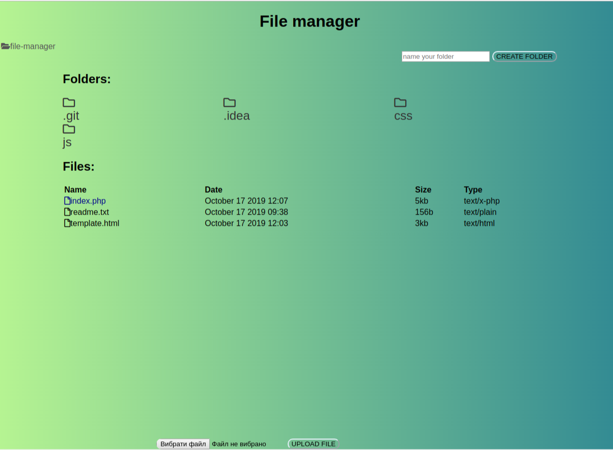

<h1>file-manager</h1>

For download file please click on file and confirm your action.

For change file(delete/copy/cut/rename) please click on context menu and select your action.

  <a href="https://drive.google.com/file/d/1egs1pZ0hQsTyb8Dz6hrQON3UN7A1DuZp/view?usp=sharing">Video demonstration</a>

I used this <a href="https://www.php.net/manual/en/session.upload-progress.php">documentation</a> <a href ="https://www.sitepoint.com/tracking-upload-progress-with-php-and-javascript/">and tutorial</a> for create progress bar
  
