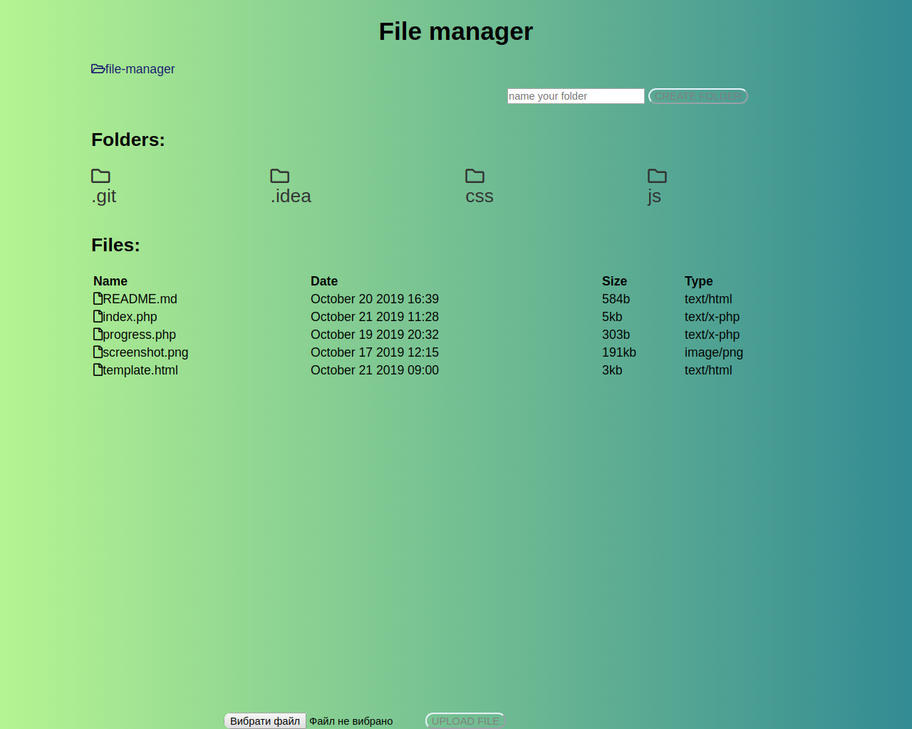

<h1>file-manager</h1>

For download file please click on file and confirm your action.

For change file(delete/copy/cut/rename) please click on context menu and select your action.

  <a href="https://drive.google.com/open?id=1MYfq3qIeCItepvYOLlRihsOvk30Zucqu">Video demonstration</a>

<a href="https://www.php.net/manual/en/session.upload-progress.php and tutorial https://www.sitepoint.com/tracking-upload-progress-with-php-and-javascript/">I used this documentation for create progress bar</a>
  <a href ="https://www.sitepoint.com/tracking-upload-progress-with-php-and-javascript/">and tutorial</a>
